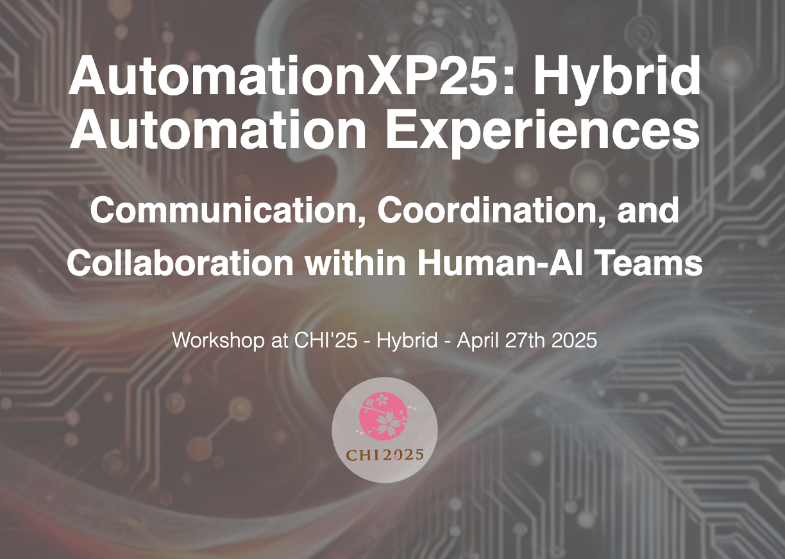
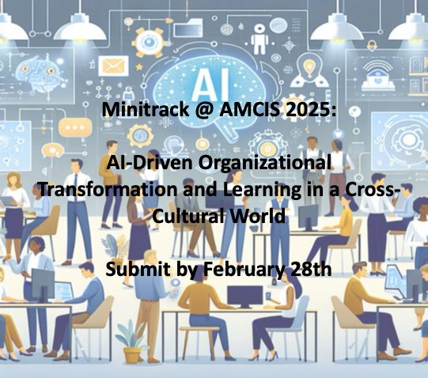

<h2>Current Research Opportunities</h2>

<ul style="font-size: 14px;">
    <li><b>AutomationXP26: Agentic Automation Experiences</b>  
    

    
    

     
    <a href="https://matthiasbaldauf.com/automationxp26/" style="text-decoration:none"><b>Follow this link </b></a> 
     This year will focus on: Rethinking the Interaction of Humans and AI Agents
    Submissions by February 13th 2025.</li>  
</ul>

<h2>Outdated topics</h2>

<ul style="font-size: 14px;">
    <li><b>Springer Nature: Computer Supported Cooperative Work - Special Issue on Automation Experiences </b>  
    

    
    

     
    Automation Experiences – Communication, Coordination, and Collaboration within Human-AI Teams  
    <a href="https://link.springer.com/collections/dacbdddbhb" style="text-decoration:none"><b>Follow this link </b></a> 
    Submissions by October 31st 2025.</li>  
    <li><b>CHI 2025 Workshop: AutomationXP25: Hybrid Automation Experiences </b>  
    

    
    

     
    <a href="https://matthiasbaldauf.com/automationxp25/" style="text-decoration:none"><b>Follow this link </b></a> 
    Submissions by February 25th 2025.</li>  
    <li><b>Mini-Track at AMCIS 2025: AI-Driven Organizational Transformation and Learning in a Cross-Cultural World </b>
     
    

    
    

     
    <a href="https://amcis2025.aisconferences.org/" style="text-decoration:none"><b>Follow this link </b></a> 
    Submissions by February 28th 2025.</li>
</ul>

